## Week 5 Lab: Buffering and Overlay in QGIS

**What You’ll Learn:** to apply the concepts of buffering and overlay, two common cartographic operations. You should read the sections on buffering and overlay in Chapter 9 in the GIS Fundamentals textbook.

**Data**: [All data are in L9.zip file](https://github.com/mapninja/Earthsys144/raw/master/data/L9.zip), including:
* `lakes.shp`
* `roads.shp`
* `public_Hugo.shp`  

https://github.com/mapninja/Earthsys144/raw/master/data/L9.zip

**What You’ll Produce:**

Two maps, of

1. lake and Road buffers
2. suitable recreation areas on private land.

### Exercise 1: Buffering in QGIS

1. Create a new QGIS project and add the roads.shp data layer.  
2. Left click Vector on the top toolbar and then Geoprocessing Tools -> Buffer

  

There are options to specify the input feature layer, the buffer distance and units, and the output.

3. Specify “**Dissolve results**” because otherwise the tool generates multiple, overlapping polygons.
4. Use the parameters shown below and add the result to your project when finished.
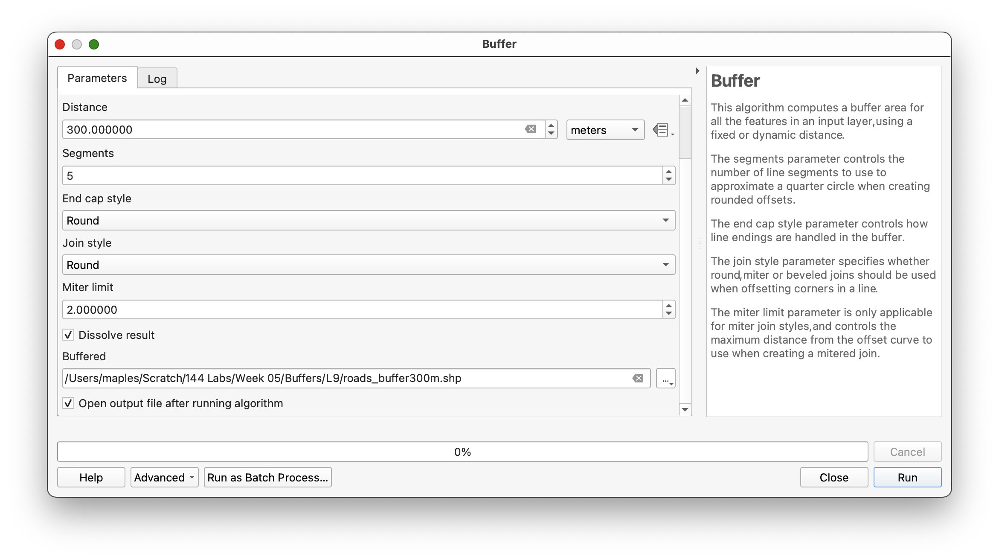

The `roadsBuffer300m` layer should look something like that below, here re-arranged to show the roads on top, and the buffer in purple below.

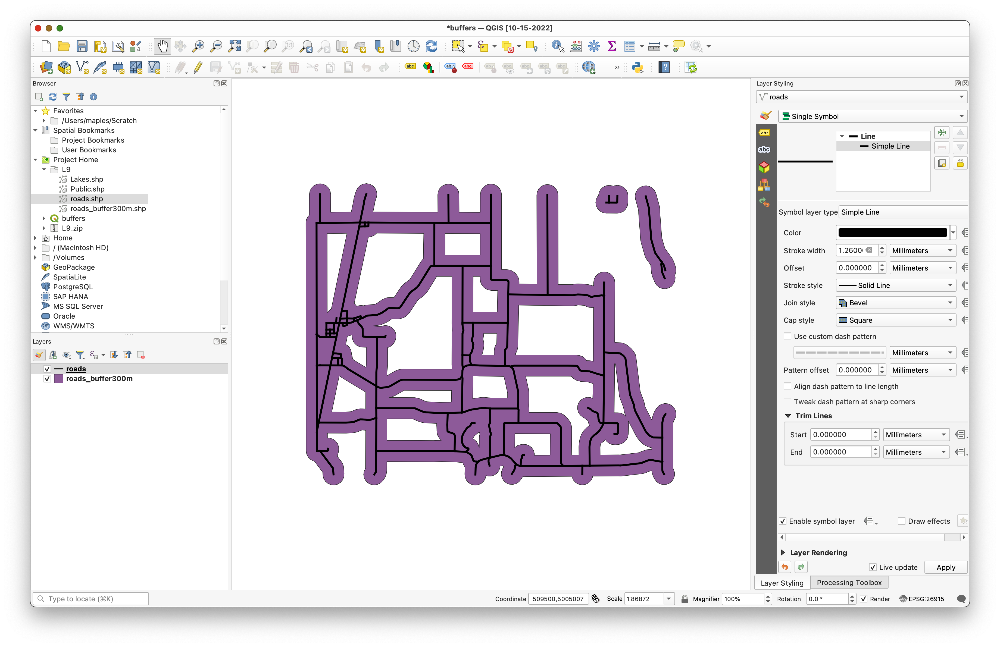
5. Redo this buffer, but this time; leave the default **Dissolve buffer results** UNCHECKED.  Make sure to open and view the attribute table associated with each buffer layer.

How do the results differ?  

When would this be important?

After inspecting, remove the undissolved layer.

## Creating a Variable Distance Buffer

The second exercise will buffer the `Lakes.shp` layer using a variable distance buffer (Video: [Variable Distance Buffer](https://youtu.be/ttrryGSjENA)).  

The buffer distances are:

* A buffer distance of `50 meters` for lakes with size `class 1`
* A buffer distance of `150 meters` for lakes with size `class 2`
* A buffer distance of `500 meters` for lakes with size `class 3`

There are three main steps:

- Open the **lakes** attribute table and **insert a field** to hold the variable buffer distance.
- **Select by Attributes** and use the **Field Calculator** to assign distance values for the variable buffer distance to groups of features, by size class `SIZE_CLS`.
- Apply the buffer operation.

### Create and calculate the `buffdist` field

1. Make sure the `Lakes.shp` is in your project, and **open its attribute table**.
2. Use **selection features by expression** to select the lakes with `SIZE_CLS = 1`.

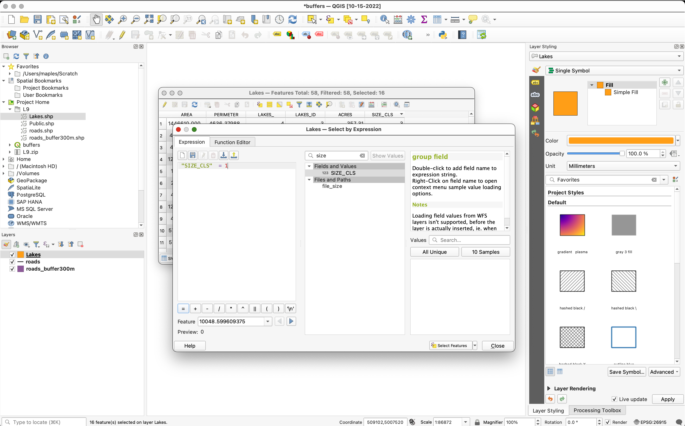

2. **Use the Field Calculator** to create a new whole number (integer) field named something like `buffdist`, with a **value** of `50`.  
3. Make sure that you have the option checked for only updating selected features, near the upper left of the tool.  Apply the calculation.

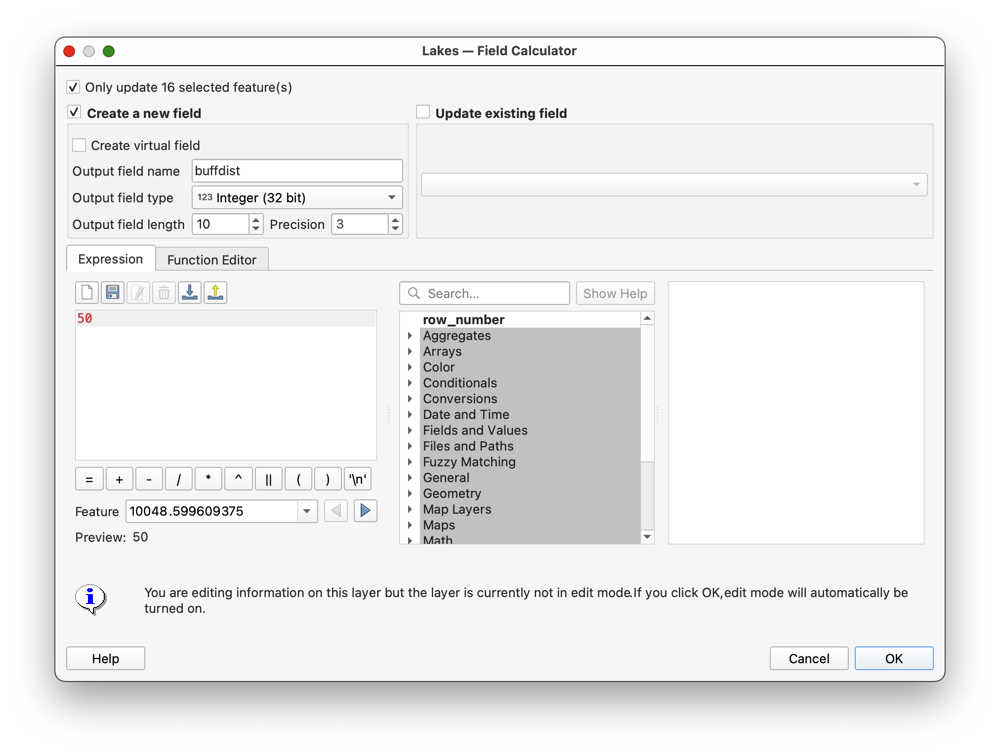

4. Now, **Select** those features with `Size_CLS = 2`, and use the** Field Calculator** to **Update an Existing Field**, assigning `150` to the `buffdist` variable.

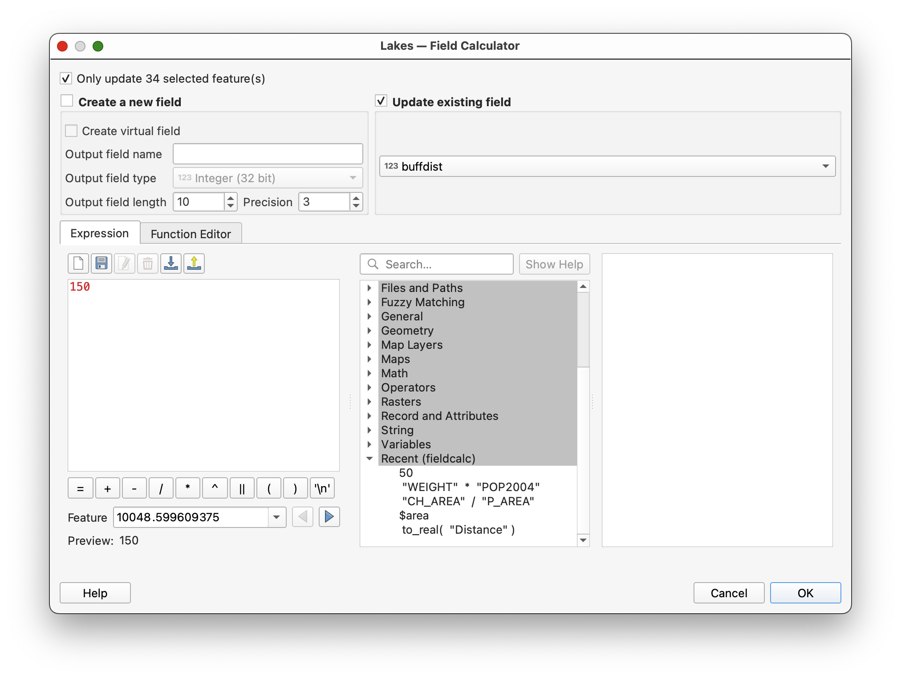
5. **Repeat** the select/assign process **for lakes with Size_CLS 3**, assigning a `buffdist` of `500`.

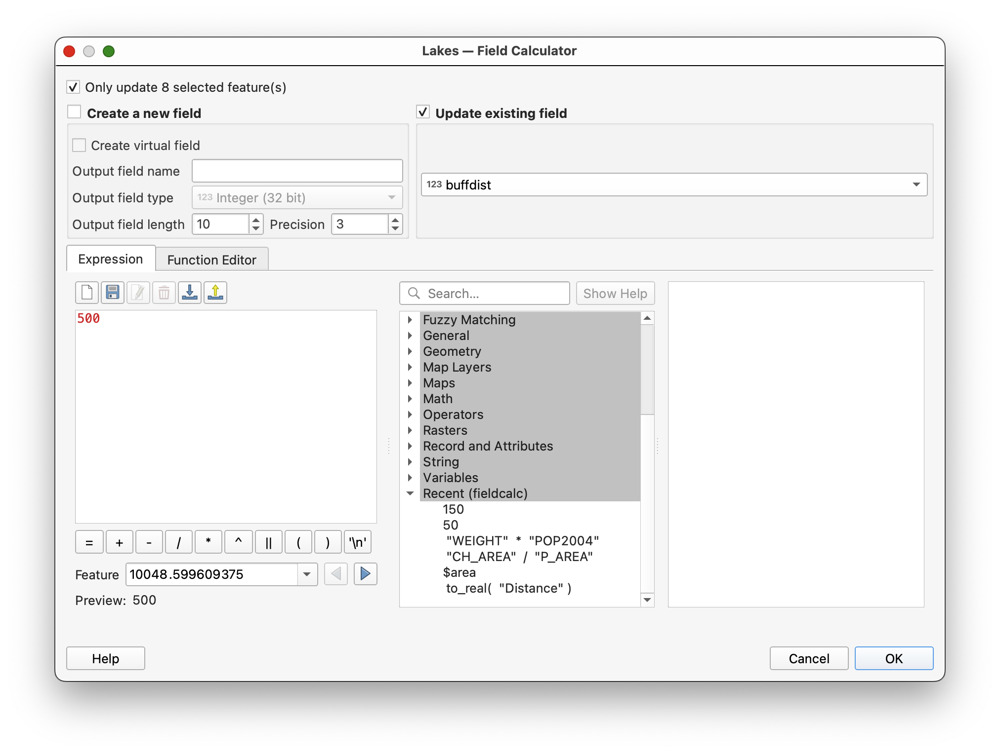

6. **Unselect any selected polygons** or the buffer will only be applied to those selected using the **Unselect all features** button 

7. Toggle off editing mode  and Save your edits.

Check that your table is correct, e.g., similar to the example figure at right.  Note that the last two columns, SIZE_CLS and buffdist, should change in concert, with a larger buffer distance appearing for larger size classes.

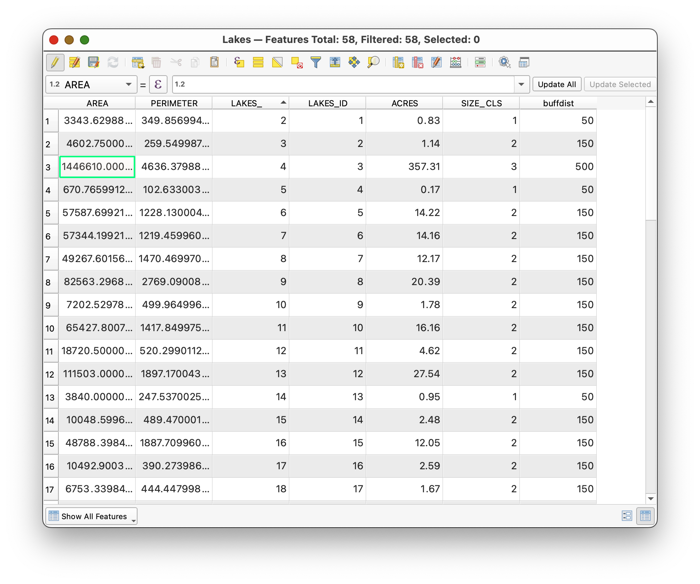

### Creating a Variable Distance Buffer

1. Use the same buffer tool as we introduced previously (**Vector->Geoprocessing->Buffer**).
2. Specify `Lakes.shp`, and also make sure to check the option to **Dissolve the result**
3. Specify a variable distance buffer through an option box, accessed by clicking on a **small box at the far right of the distance/units option** (see arrow below).

This allows us to open a sequence of dropdowns:

4. Choose **Field type**: `int, double, string...` , and then `buffdist` as the variable that contains the buffer distance (see figure below).
5. specify an output, something like `VarBuffLakes`, and run the tool.

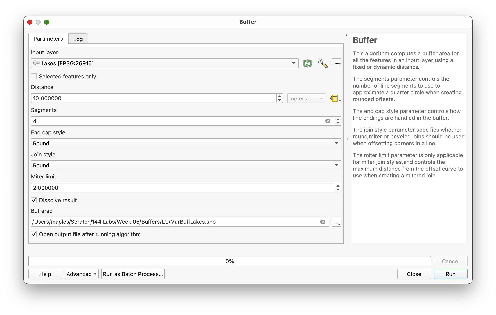

This should create a layer similar to that below.  Note the buffers are larger for the larger lakes, as per our specified buffer distance variable.

Arrange the roads, dissolved fixed distance road buffer, lakes, and variable distance lake buffer layers so that you can see all three, as in the figure below.

Save here and proceed to the next part (scroll down). Remember to save often.

### To Turn In:

Create and export a layout with the roads, lakes, and their buffers, as in the view shown below.  

Make sure the order is as shown here, so you may see most of each layer. The order is, from the top:   
1. roads,
2. lakes,
3. lake buffer
4. road buffer

label each layer with descriptive text in the TOC/legend, and be sure to include a scale bar, north arrow, title and your name.

## Part Two: Overlay Analysis in QGIS

Our goal in this exercise is to find potential campgrounds for a State Park.  A campground needs to be close to lakes, but these will be drive-in sites that must also be close to roads. The final map will show locations that are both within 50, 150 or 500 meters of a lake (depending on the size of the lake) and within 300 meters of a road.

You have already created your starting layers.  These are the variable distance lakes buffer and the fixed distance roads buffer from the previous exercises.  

We need to modify input layers prior to overlay so that we may easily interpret the results after overlay.

First, we must turn the buffer output to single part features.  Buffer returns multipart features, which means there may be multiple polygons for a single row.

1. Open the attribute table for `VarBuffLake`, you should see just one row, while the layer obviously has many polygons.

2. To convert this multipart layer to single parts, use **Vector->Geometry Tools-> Multipart to Singleparts**, naming the output something useful, like: `SingleLakeBuffers`

3. After running the tool, **open the attribute table** for the output.  Note that there are now multiple entries, one for each polygon.

Also note that the `buffdist` is now wrong, it has a value of `50` for all the polygons (or perhaps one of the other values, `150` or `500` is repeated, the one it saves appears somewhat random), even though the medium and large sized lakes had different buffer distances. Since the columns we have in this layer aren’t useful, it’s helpful to delete them:

4. Open the attribute table of the `SingleLakeBuffers` layer, **toggle ON editing** and click on the **delete field**  tool.

5. **Select all of the fields** and **click OK** to delete them (it’s OK, don't be nervous! They aren’t useful!).

6. Now, create a new column called `inlakebuff` in the `SingleLakeBuffers` table, with a **value** of `1` for all the lake buffer polygons, using the **Field Calculator**.

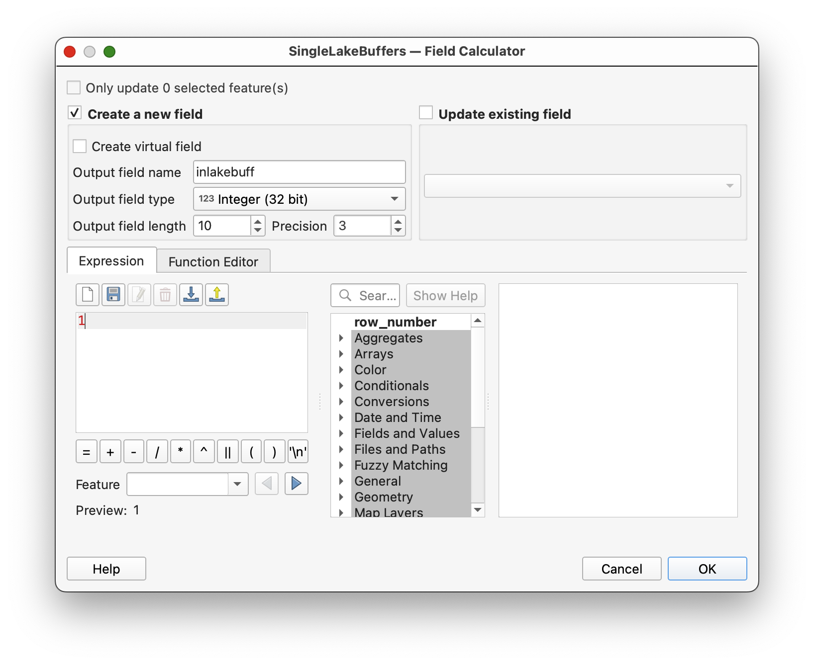

7. Repeat the same steps for the `road buffer layer`:
    1. **Convert to SinglePart** features, as `singlepartroadsBuffer300m.shp`
    2. Clean the attribute table, **deleting all the current fields**
    3. **Add a new attribute** named something like `inroadbuff`, and assign it a **value** of `1` to indicate it is inside the road buffer.  

8. Remember to **toggle off editing and save** for each layer when complete.

Before we overlay the two layers with the “**Union**” command, we need one more preparation step.  

### Erasing the Lakes from their buffers

The `SingleLakeBuffers` layer we created has buffered areas that include the lake as well as the land near shore. Campsites will be on dry ground, so we will use the **Difference** tool to remove the lake from the lake buffer layer.

9. Open the **Vector>Geoprocessing Tools>Difference**
10. Specify Input Vector Layer as the `SingleLakeBuffers`

11. Specify the Difference Layer as the `lakes` layer

12. Set the output destination to something like `LakeBuffersOnly.shp`   

13. Click Run

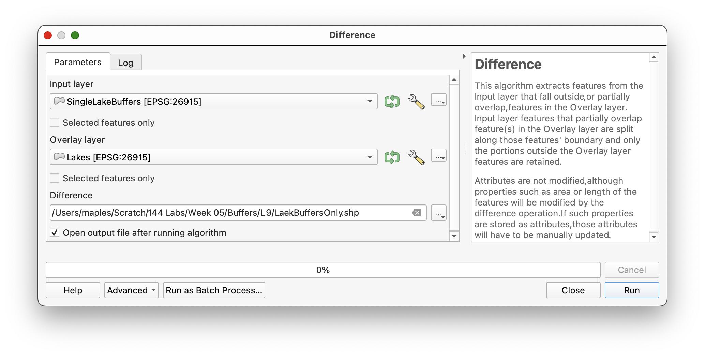

Display the output and verify that the results are the lakes buffer layer with the lakes area removed:

## Using Union to combine layers  

14. Select **Vector>GeoprocessingTools>Union**
15. Specify the input layers – `LakesBuffersOnly` (as the input layer) and `singlepartRoadsBuffer300m` (as the overlay layer)
16. Specify the output layer something like `BufferUnion`, and **Run**.

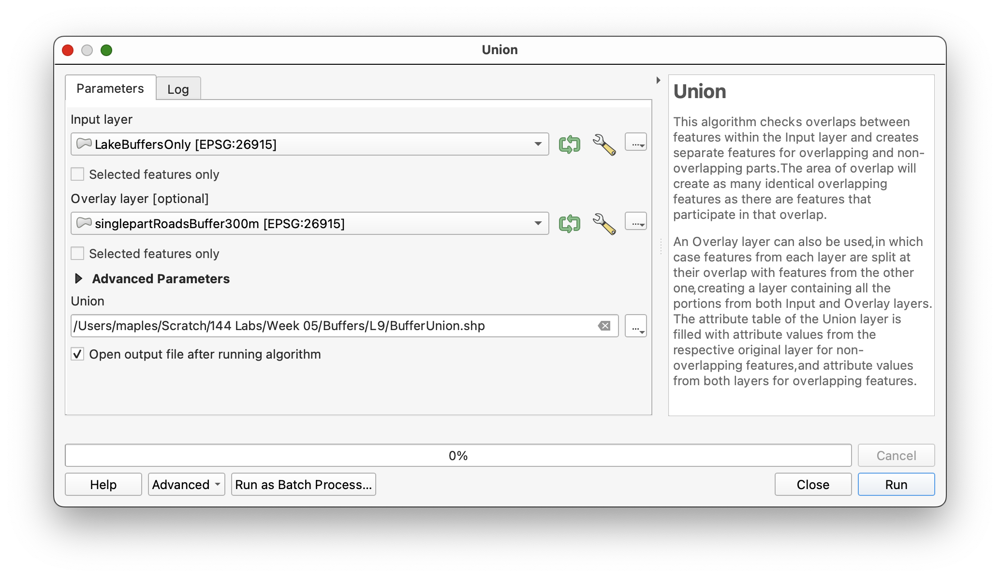

17. Open the **attribute table** and examine the new `BufferUnion` layer.   

18. Scroll down the table and find a record for which `inlakebuff` and `inroadbuff` are both = `1`.  

19. Click on the Numbered Square to the left of the record to Select it,

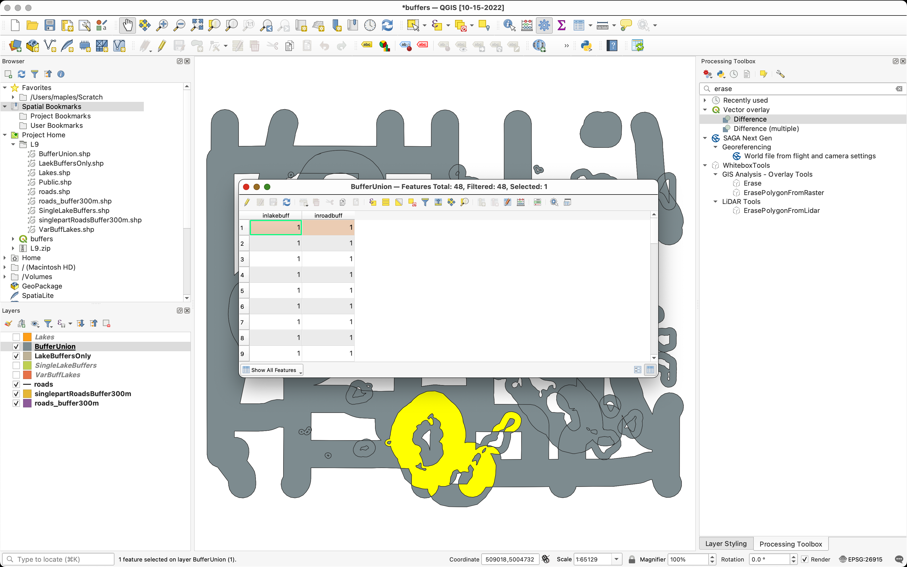

20. Use the Zoom to Selected tool

21. Move or close the attribute table to view the selected polygon.

The selected polygon meets both the road proximity and lake proximity criteria.

Note that there also appear to be multiple, distinct polygons linked to this row.

QGIS groups polygons in the data files when performing analysis.  When we are finished with our analysis we will “ungroup” polygons in the file, creating a table row for each polygon.

21. Return to the attribute table of `BufferUnion`  

22. Use the **Select features using an expression  tool**

  

to create an expression  that selects the features that have  a value of 1 for both the inlakebuff and inroadbuff columns:  

`"inlakebuff"  = 1 AND "inroadbuff" = 1`

This should yield the selection, below. (HINT: right-click and Zoom to Layer to see the whole layer selection)

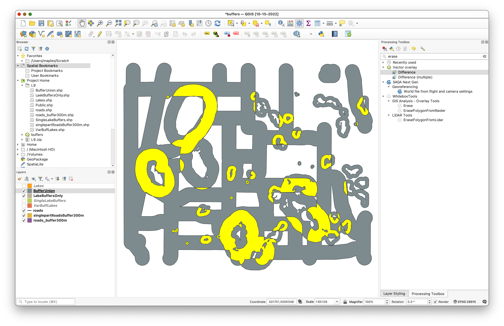

Upon visual inspection, these are the polygons within both the road and lake buffers.

23. With the selection still active, right click on the `BufferUnion`, then  

24. **Export>Save Selected features as…** as something appropriate, like `Candidates.shp`, and verifying that the option to **Save only selected features** is checked.

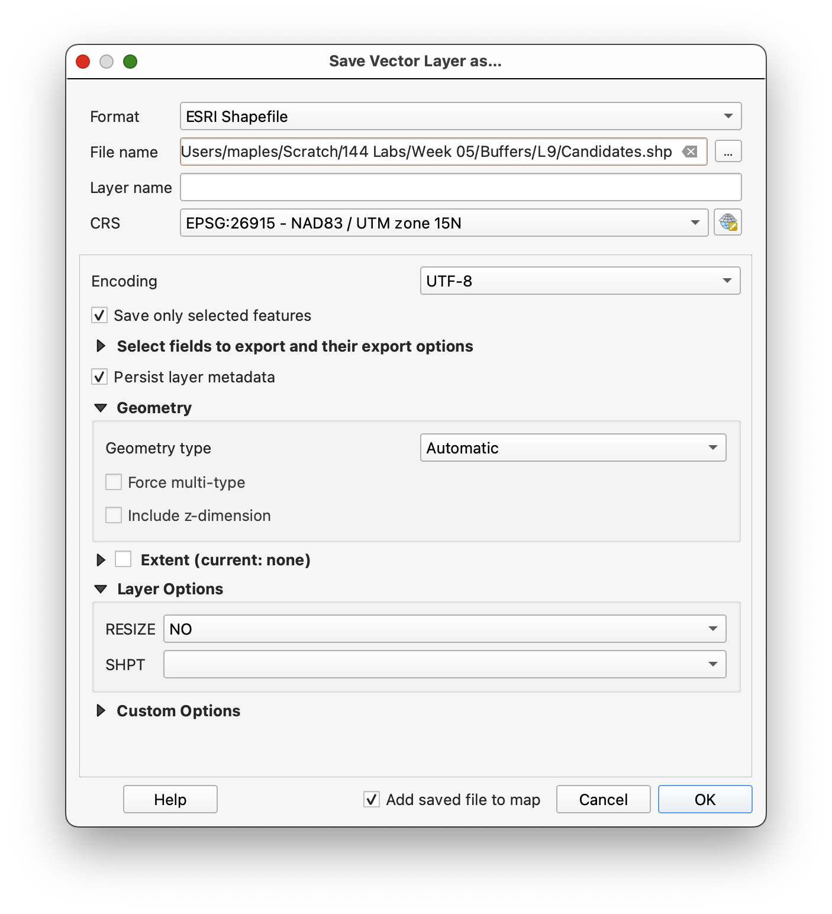

Display the data and verify that you have something like the following:

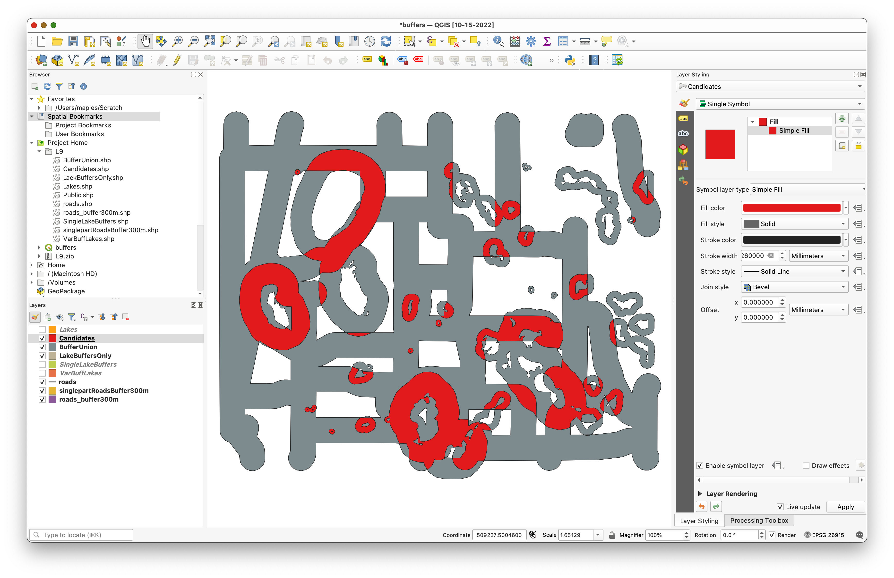

25. Use the manual selection tool, and verify that some of these are still multipart, by clicking on a few polygons.

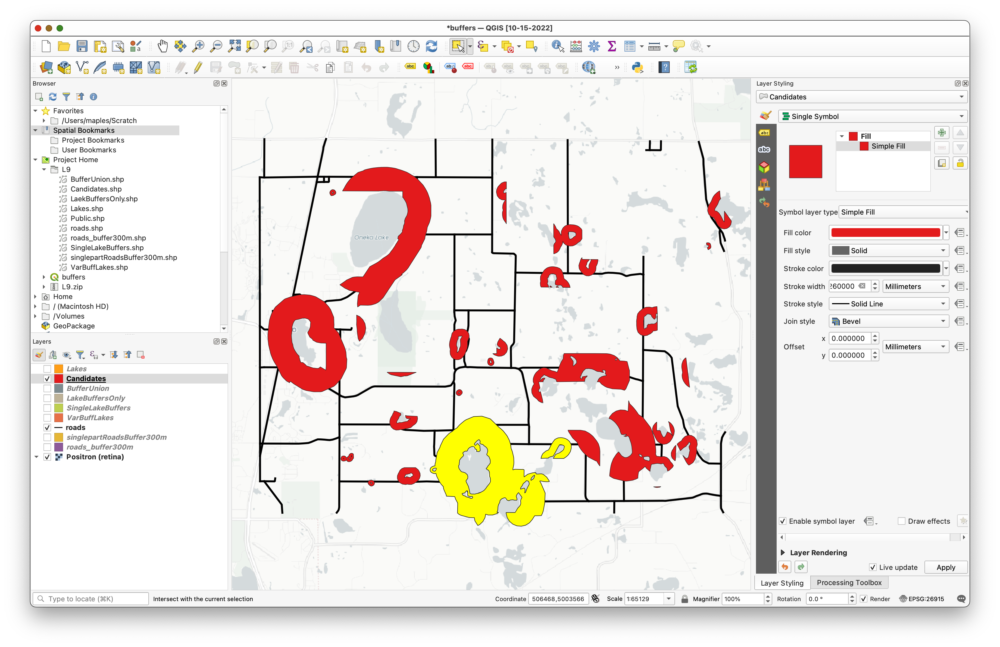

26. Be sure to clear your selection.

We have one final criteria to meet, that these campgrounds be on private land.

1. Add the `Public.shp layer` to your project.

2. Use the Difference tool, as above, to create a new layer called FinalCandidates that excludes all **Public.shp **features.

The westernmost lakes should look like the figure here, with the public bits carved out of the lower lake:

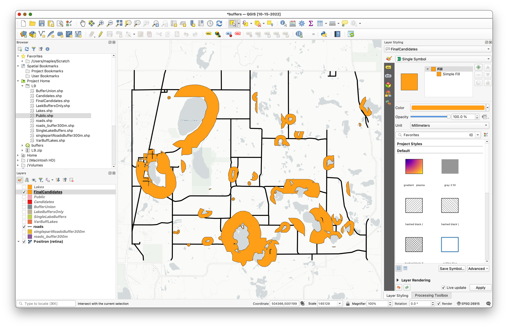

### To Turn In:

Create a Layout that includes:

* roads,
* lakes, and
* lands suitable for campgrounds on private land

Label each layer with descriptive text in the legend, and include a scale bar, north arrow, title and name.

(HINT: I played with the “**Layer Rendering** for the `FinalCandidate` layer, using **Difference** and then an **Inner Glow** from the **Draw Effects** option, at the bottom of the layer styling panel.
